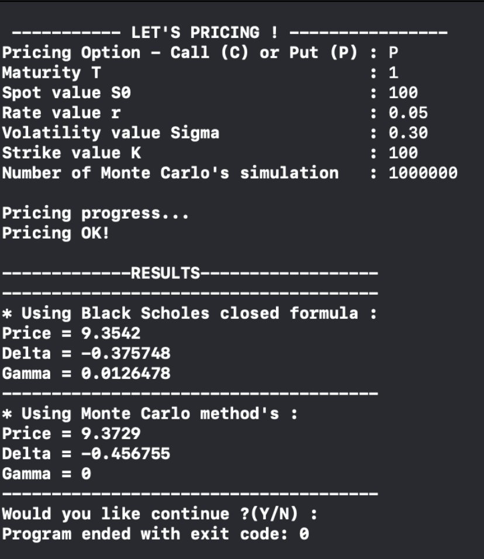

# Pricer-Monte-Carlo

## Abstract

Le but de notre code est de calculer le prix d'une option et ses grecs (sensibilités du prix de l'option à ses paramètres) via Monte-Carlo. Pour cela nous utilisons tout d'abord, les formules de Black and Scholes (B&S), pour calculer le prix de nos options et des grecs comme point d'ancrage pour la vérification du Monte-Carlo et aussi pour calculer l'erreur d'estimation des simulations (l'intervalle de confiance). Nous simulons ensuite via Monte-Carlo, N simulations mouvements Browniens géométriques pour retrouver notre prix ou bien nos sensibilités delta (**∆**) et gamma (**Γ**) sous Black and Scholes en formule fermée.

Plusieurs classes ont été créées pour implémenter notre code. Concernant l'architecture (voir Excel "ArchitectureProjet.xlsx") notre code s'articule autour de trois grands axes :
- Un axe **Loi**
- Un axe **Pay-off**
- Un axe **Monte-Carlo**

## 1) Axe Loi

Pour pouvoir simuler notre Monte-Carlo il nous faut simuler des lois et des mouvements browniens. Tout d'abord rappelons que toutes nos classes découlent d'une seule classe : la classe CProbaLaw. Nous utilisons donc ici l'héritage et le polymorphisme sur toutes les classes qui en découlent. Les classes en rapport aux simulations de la sont:
- **CProbaLaw** : Classe mère qui est une classe virtuelle pure pour donner la forme des classes filles.
- **CProbaLawWithMoment** : Classe mère/fille qui est aussi une classe virtuelle pure, cette classe nous retourne les moments d'ordre un et deux. Celle-ci hérite CProbaLaw.
- **CUniforme** : Classe fille, cette classe hérite de **CProbaLawWithMoment** et permet de simuler la loi uniforme qui nous permettra de simuler la loi normale.
- **CNormale** : Classe fille, cette classe hérite de **CProbaLawWithMoment** et permet de simuler la loi normale via la méthode de **Box-Muller**. Rapidement, sa définition mathématique est la suivante. Soient 
 et  deux variables aléatoires indépendantes uniformément distribuées dans ]0,1]. Soient,

 
 

    et

 
 

Remarquons qu'il ne nécessite pas une explication plus formelle concernant ces classes, le nom les explicitant correctement. En revanche, nous nous attarderons sur certaines classes plus importantes et ayant plus d'intérêt.

Les classes en rapport aux simulations de mouvements browniens géométriques sont :
- **CProcess** : Classe mère/fille, elle hérite de **CProbaLaw**. Elle permet également de préparer l’évolution du code a de nouveaux processus stochastiques (type Ornstein-Ulhenbec).
- **CBrownian** : Classe fille, elle hérite de **CProcess**. Elle viens prendre la loi normale pour l’accroissement du mouvement brownien.
- **CGeometricBrownian** : Classe fille, elle hérite de **CProcess**. Cette classe permet de simuler le modèle Black and Scholes pour la méthode d’estimation de Monte-Carlo.

## 2) Axe Pay-off

Une fois que nous avons simulé notre Brownien, nous venons ici calculer nos prix via le Pay-off. Nous utilisons donc des pointeurs pour une instance de ces Pay-off pour calculer, justement, le Pay-off à chaque simulation.

Les classes en rapport avec le pay-off sont :
- **CVanillaOptionBS** : Classe fille, hérité de **CProbaLaw**, elle permet de définir les paramètres du pay-off comme le taux d’intérêt, la volatilité etc. Elle contient un pointeur sur CPayOff.
- **CPayOff** : Classe mère virtuelle pure elle permet d’instaurer la structure de ses classes filles.
- **Cput** : Classe fille héritant de CPayOff qui calcule le pay-off d’un put.
- **CCall** : Classe fille héritant de CPayOff qui calcule le pay-off d’un call.
- **CDiscountFactor** : Cette classe qui ne dépend pas d’autre classe (pas classe fille) permet de modéliser le facteur d’actualisation.

Il est intéressant de noté que nous pourrions donc ajouter d’autres classes de pay-off différents comme par exemple un butterfly, un straddle ou un bear-spreadn héritant tous de la classe CPayOff.

## 3) Axe Monte-Carlo

Cet axe est scindé en deux sous-parties. La première sous-partie est une définition mathématique basique du concept de Pricing en Monte-Carlo. La seconde sous-partie d ́ecrit son implémentation en C++.

### 3.1) Monte-Carlo, principes fondamentaux

Dans le modèle de Black-Scholes, l’évaluation d’un contrat d’option Call (soit le pricing d’un Call), est :

 

Où:
- P est le prix du Call
- r est le taux sans risque
- T est la maturité
-  est la mesure de probabilité risque neutre
- S est le prix de l'actif risqué, soit le sous-jacent
- K est la valeur du Strike
-  est la volatilité du sous-jacent
-  est un mouvement brownien géométrique

Rappelons que par La Loi des Grands Nombres on a:

Posons  indépendamment et identiquement distribuées (i.i.d) et d'espérance finie .

De plus, considérons , alors :

 
&plus;\infty&space;}&space;\hat{S}&space;=&space;E[\xi^{(I)}]" title="\lim_{N->+\infty } \hat{S} = E[\xi^{(I)}]" align="center"/>

Ceci nous donne donc l'estimateur de Monte-Carlo du prix tel que :

 
 

 
 

### 3.2) La classe Monte-Carlo

Les classes en rapport avec Monte-Carlo :
- **CMonteCarloMethod** : Cette classe permet de calculer le prix d’option via la méthode de Monte-Carlo, elle permet aussi de connaître l’erreur d’estimation. En l’occurrence ici nous nous servons pour calculer une option vanille de type call/put. Nous avons implémenter la méthode pour calculer le prix et l’intervalle de confiance.

Ce code a été d ́eveloppé dans l’optique de pouvoir rajouter d’autres classes sans avoir besoin de le re- structurer. En effet, nous pouvons voir que grâce au polymorphisme et à la dérivation des classes cela simplifie l’ajout de nouveau process et de pay-off. Nous pouvons donc imaginer l’ajout d’options a barrières ou l’ajout de processus d’Ornstein-Uhlenbec. Cela permet de préparer l’évolution du code à de nouvelles fonctionnalités sans tout restructurer ce dernier.

## 4) A Propos du Main et de l'interface utilisateur

Nous avons d ́eveloppé une classe **CInterfacePricer** pour mettre plus au clair notre code. En effet, en mettant des cin au lieu de laisser l’utilisateur modifier le main, cela permet de ne pas faire d’erreur opérationnelle lors de la manipulation. Le code permet d’être bien plus clair lors de son utilisation ce qui permet de directement calculer son pay-off. Si nous n’avions pas fait d’interface utilisateur, ce dernier aurait dû aller dans le main pour mettre à la main à la ligne correspondante les paramètres d ́esirés. L’objectif étant donc juste de lancer le code et de lire les commandes indiquées. Une précision est a apporter, c’est que le code ne prend pas les paramètres en pourcentage donc la maturité est exprimée en ann ́ee, et les volatilités et taux d’intérêt sont en base 1.

## Appendix A  Exemples d'utilisation du projet

 

