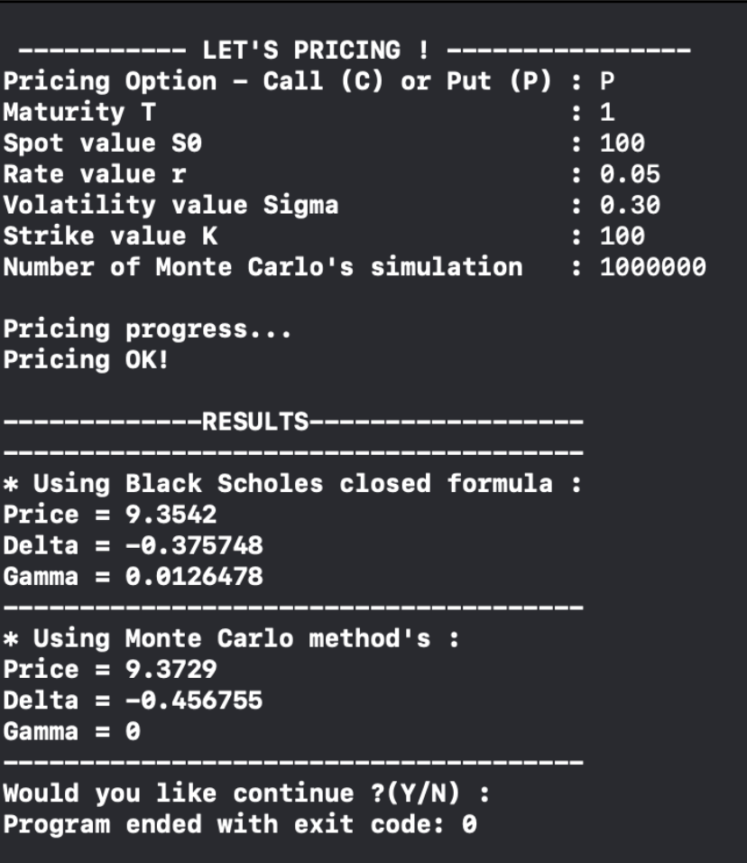
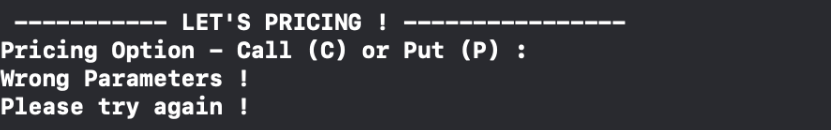

# Pricer-Monte-Carlo

## Abstract

Le but de notre code est de calculer le prix d'une option et ses grecs (sensibilités du prix de l'option à ses paramètres) via Monte-Carlo. Pour cela nous utilisons tout d'abord, les formules de Black and Scholes (B&S), pour calculer le prix de nos options et des grecs comme point d'ancrage pour la vérification du Monte-Carlo et aussi pour calculer l'erreur d'estimation des simulations (l'intervalle de confiance). Nous simulons ensuite via Monte-Carlo, N simulations mouvements Browniens géométriques pour retrouver notre prix ou bien nos sensibilités delta (**∆**) et gamma (**Γ**) sous Black and Scholes en formule fermée.

Plusieurs classes ont été créées pour implémenter notre code. Concernant l'architecture (voir Excel "ArchitectureProjet.xlsx") notre code s'articule autour de trois grands axes :
- Un axe **Loi**
- Un axe **Pay-off**
- Un axe **Monte-Carlo**

## 1) Axe Loi

Pour pouvoir simuler notre Monte-Carlo il nous faut simuler des lois et des mouvements browniens. Tout d'abord rappelons que toutes nos classes découlent d'une seule classe : la classe CProbaLaw. Nous utilisons donc ici l'héritage et le polymorphisme sur toutes les classes qui en découlent. Les classes en rapport aux simulations de lois sont :
- **CProbaLaw** : classe mère purement virtuelle pour donner la forme des classes filles.
- **CProbaLawWithMoment** : classe mère/fille purement virtuelle retournant les moments d'ordre un et deux ; elle hérite de CProbaLaw.
- **CUniform** : classe fille héritant de **CProbaLawWithMoment**, elle permet de simuler la loi uniforme.
- **CNormal** : classe fille héritant de **CProbaLawWithMoment**, elle permet de simuler la loi normale via la méthode de Box-Muller.

Les classes en rapport aux simulations de mouvements browniens géométriques sont :
- **CProcess** : classe mère/fille, hérite de **CProbaLaw**, elle prépare l’évolution vers de nouveaux processus stochastiques.
- **CBrownian** : classe fille, hérite de **CProcess**, simule le mouvement brownien via une loi normale.
- **CGeometricBrownian** : classe fille, hérite de **CProcess**, simule le modèle Black-Scholes pour la méthode de Monte-Carlo.

## 2) Axe Pay-off

Une fois que nous avons simulé notre Brownien, nous calculons nos prix via le pay-off. Nous utilisons un pointeur sur une instance de CPayOff pour calculer le pay-off à chaque simulation.

Les classes en rapport avec le pay-off sont :
- **CVanillaOptionBS** : classe fille héritant de **CProbaLaw**, définit les paramètres du modèle (taux, volatilité, etc.) et contient un pointeur sur **CPayOff**.
- **CPayOff** : classe mère purement virtuelle instaurant la structure des pay-off.
- **CPut** : classe fille héritant de **CPayOff**, calcule le pay-off d’un put.
- **CCall** : classe fille héritant de **CPayOff**, calcule le pay-off d’un call.
- **CDiscountFactor** : modélise le facteur d’actualisation.

Il est possible d’ajouter d’autres pay-off (butterfly, straddle, bear-spread, etc.) en héritant de **CPayOff**.

## 3) Axe Monte-Carlo

Cet axe est scindé en deux sous-parties. La première présente la théorie du pricing par Monte-Carlo, la seconde décrit l’implémentation en C++.

### 3.1) Monte-Carlo, principes fondamentaux

Dans le modèle de Black-Scholes, l’évaluation d’un contrat d’option Call (pricing d’un Call) est :

Où :
- P est le prix du Call
- r est le taux sans risque
- T est la maturité
-  est la mesure risque-neutre
- S est le prix de l'actif sous-jacent
- K est le strike
-  est la volatilité
-  est un mouvement brownien géométrique

Par la loi des grands nombres, pour des variables indépendantes identiquement distribuées (i.i.d.)  d'espérance finie :

L'estimateur Monte-Carlo du prix est :

### 3.2) La classe Monte-Carlo

- **CMonteCarloMethod** : calcule le prix et l’intervalle de confiance par Monte-Carlo. Elle exploite les fonctions de **CProbaLaw** pour simuler prix et grecs.

Grâce au polymorphisme, il est facile d’ajouter de nouveaux pay-off ou processus sans restructurer le code.

## 4) À propos du main et de l'interface utilisateur

La classe **CInterfacePricer** gère l’interface console, évitant à l’utilisateur de modifier le code source pour entrer les paramètres. Le programme lit T, S0, r, sigma, K et NMC en base 1 (taux et volatilité non en pourcentage).

## Appendix A : Exemples d'utilisation du projet

 

 Figure 1: Exemple d'utilisation du code avec l'interface utilisateur

 

 Figure 2: Exemple d'erreur de choix de paramètres

